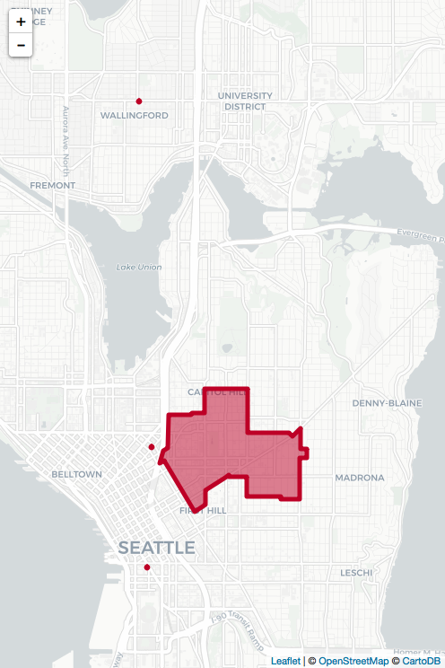
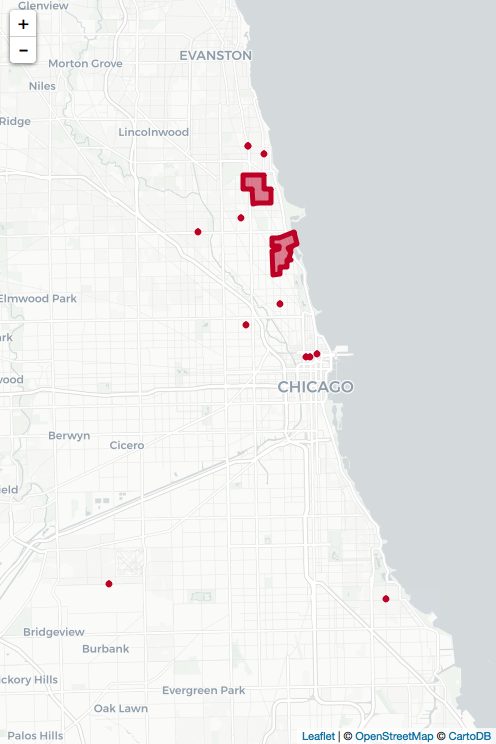
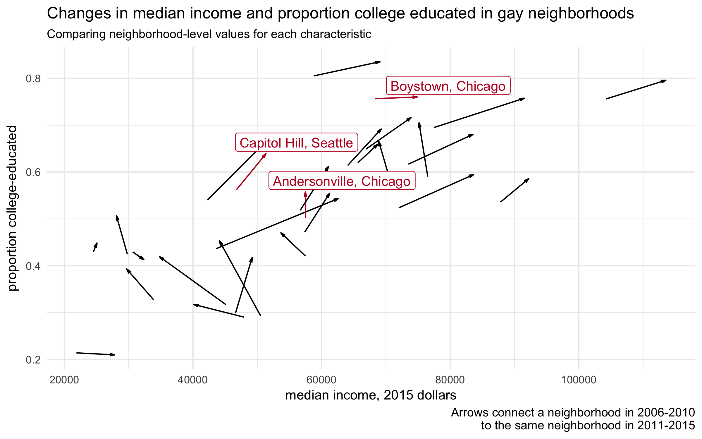
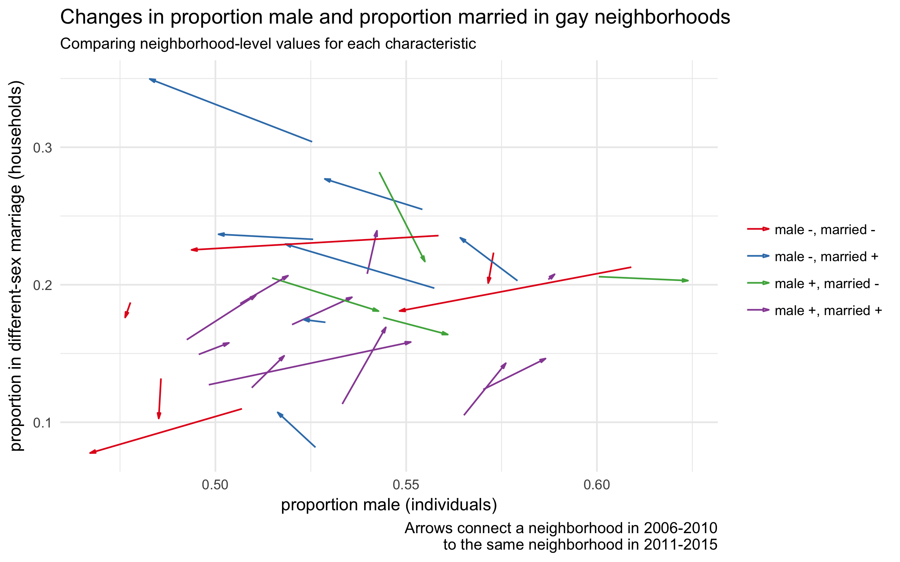
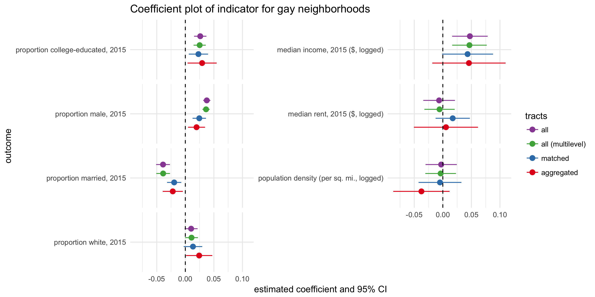

# About me

.left-column[

]

.right-column.font150[

PhD student in **sociology** at the University of Washington

- methods: quantitative & computational

- topics: community and social change

- case: LGBTQ communities & populations

]

---
# Project overview

What's happening to gay neighborhoods across the United States, and why?

Examine patterns and variations in gayborhood trajectories in a broad, comparative way

Context: MA thesis, single-authored project, currently revising for publication

---
# Motivation

### Are gay neighborhoods really disappearing? 

Historical, ethnographic, & interview research provides evidence for **cultural and institutional changes** in some gay enclaves .font60[(e.g. *There Goes the Gayborhood?* (Ghaziani 2014), *Boystown* (Orne 2017))]

Popular & media narratives suggest **assimilation and gentrification** as culprits, linking cultural changes to **demographic and economic** factors

This framing implies processes *unique to* gay neighborhoods are at play

---
# Challenges

.font200[

No systematic way to define and identify gay neighborhoods

No data on LGBTQ populations at small geographies (and data on same-sex couple households aren't adequate)

]

---
# Approach

.font200[

1. Define and identify gay neighborhoods

2. Examine their characteristics over time

3. Compare them to other places

]

---
# Approach

1. *Define and identify gay neighborhoods*

	→ clusters of gay bars from a 2007 digital archive
	
2. *Examine their characteristics over time*

	→ American Community Survey data from 2006-2015
	
3. *Compare them to other places*

  → linear models of Census tracts, matched within cities

---
# Identifying gayborhoods

- Webscrape gay bar listings from 2007 (GayCities.com + Wayback Machine)

- Geocode addresses to latitude & longitude (Google Maps API)

- Geocode lat/lon to Census tracts

- Identify largest clusters of tracts with bars (spatial adjacency)

- Curate cities and neighborhoods (qualitatively)

From 840 bars in 57 places

to 488 Census tracts

to 28 neighborhoods in 23 cities

---
# Examples

.pull-left.center[

Capitol Hill,  
Seattle

]

.pull-right.center[

Boystown and Andersonville,  
Chicago

]

---
# Outcomes

7 indicators of social, demographic, and economic change, from the American Community Survey (5-year) for 2006-2010 and 2011-2015

general measures of urban change: 

- proportion college-educated
- median income
- median rent
- proportion white

measures specific to gender and sexuality: 

- proportion male
- proportion different-sex married-couple households

a necessary control:

- population density 

---
# Analysis

### Descriptive: 

Visualize the trajectories of gay neighborhoods, and compare them to each other

### Statistical:

Compare gay neighborhoods to other places using linear models of the 7 measures of change:

$$x_{2011-2015} = \alpha + \beta_1 gay + \beta_2 x_{2006-2010} +X\beta_{controls} + \epsilon$$

What's a fair comparison? Two methods beyond linear regression: 

1. **matching tracts** on 2006-2010 covariates (using Mahalanobis distance)
2. **multilevel models** (varying intercepts by city)

---
# Results: patterns

---
# Results: variations

---
# Results: models

---
# Conclusions

Demographic and economic change in gay neighborhoods is **not intense or widespread**

Observed changes are **largely not distinct** from other urban places---change in education levels excepted

Gayborhoods are subject to the same urban processes as other places---they differ in their **symbolic impact** for LGBTQ people

---
# Implications

*What are the stakes of this work?*

These places deeply matter to groups of people, who fear losing them; this work shows that's not happening everywhere

*Where should we look to explain what's happening to gay enclaves?*

Changes often seem more about local urban forces; policies aimed at mitigating change likely need to be specialized

---
# Extensions

**Data**

- historical
  - Decennial Census (2000 -> 2010)
  - Other listings of gay institutions (e.g., the Damron travel guides)

**Statistical**

- rabbit hole vs rigor

we'd like to know about people too, right

in my dream world, the American Community Survey would ask a question about sexual orientation. 

only good for answering similar questions in the future

why bother? what are the stakes of getting this right
